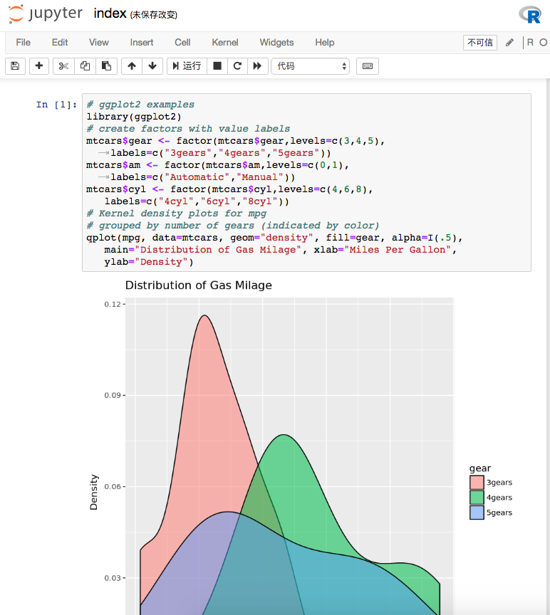

# Jupyter

[Jupyter][1] Notebook可以允许在网页页面中直接编写代码和运行代码，得到运行结果，用户在网页界面中可以完成整个数据科学的工作流程，包括数据清理、统计建模、构建和训练机器学习模型、可视化数据等等。这种交互界面大大方便了研究人员进行数据科学的开发和调试。



由于集群上计算节点是无法被用户直接访问，用户只能访问集群的登录节点，而登录节点原则上不允许直接运行 Jupyter 等程序，这里使用了SSH隧道技术来支持Jupyter。

1. 使用我们提供的脚本启动Jupyter
2. 建立SSH隧道
3. 在个人浏览器打开Jupyter界面
4. 不用时，及时杀死Jupyter作业和SSH隧道进程

## 设置Jupyter登录密码

在开始之前先设置Jupyter的登录密码：

```bash
module load anaconda/5.3.0
jupyter notebook --generate-config
jupyter notebook password
Enter password:  ****
Verify password: ****
[NotebookPasswordApp] Wrote hashed password to .../.jupyter/jupyter_notebook_config.json
```

## 使用我们提供的脚本启动Jupyter

从GitHub上克隆我们提供的样例，其中 `cluster-tutorials/jupyter` 为启动脚本程序。用户可以根据需要将这个目录copy到自己指定的目录。


```bash
git clone https://github.com/masterstevelu/cluster-tutorials.git
cd cluster-tutorials/jupyter/
```

### 使用 Anaconda 的Jupyter

```bash
module load anaconda/5.3.0
sh jupyter.sh
Enter a number between 9001 and 9999: 9001
valid port_number


SSH Tunnel INFO:

Mac/Linux:
ssh -N -L 9002:node-2-12:9002 luweizheng@183.174.229.251

Windows:
Remote server: node-2-12
Remote port: 9002
SSH server: 183.174.229.251
SSH login: luweizheng
SSH port: 22
```

脚本打印出使用SSH隧道的帮助信息。

### 使用容器进行深度学习

对于有深度学习需求的用户，目前我们的操作系统版本不支持直接安装 TensorFlow 或者 PyTorch，请使用Singularity容器进行深度学习。请根据提示输入容器镜像位置和端口号。

```bash
sh singularity_jupyter.sh
Enter singularity image path: /mnt/data/container_library/deep_learning/all-py36-jupyter-cpu
Image exists!
Enter a number between 9001 and 9999: 9001
valid port_number

SSH Tunnel INFO:

Mac/Linux:
ssh -N -L 9001:node-2-12:9001 luweizheng@183.174.229.251

Windows:
Remote server: node-2-12
Remote port: 9001
SSH server: 183.174.229.251
SSH login: luweizheng
SSH port: 22
```

这里加载了一个将所有深度学习框架打包的镜像，包含了TensorFlow、PyTorch等框架。用户也可以自己创建并使用自己的镜像，更多关于singularity的内容，请参考我们的[文档](singularity.md)。


## 建立SSH隧道		

SSH隧道的原理如图所示，我们为了访问原本无法访问的 node-0-1，需要建立一个隧道。刚刚启动Jupyter所用的端口号9001，即为Remote Server Port。


**Mac和Linux用户**

直接使用刚才屏幕上打出来的ssh命令

```bash
ssh -N -L 9001:node-2-12:9001 luweizheng@183.174.229.251
```

记得这里为拷贝为刚才启动脚本打印出来的命令代码。

**Windows用户**

MobaXterm 用户 可以在“Tools”下“MobaSSHTunnel (port forwarding)”中选择“New SSH Tunnel”，选择“Local port forwarding” 选项，在Remote Server处将端口号和服务器填写进去。然后启动这个SSH隧道。

其他SSH客户端用户可以根据上述原理配置SSH隧道的转发规则。

# 在个人电脑浏览器打开Jupyter界面

访问该URL即可使用Jupyter服务：

`http://localhost:9001/`

## 关闭Jupyter

不需要时，请在使用 `qstat` 查看 jupyter 作业号，并及时使用 `qdel` 杀死作业。

SSH客户端要及时杀死之前启动的隧道。

!!! note "启动Jupyter作业"
		我们提供的作业脚本限制了一个用户只能启动一个Jupyter作业。这样是为了避免用户因为疏忽，忘记自己之前开启过的Jupyter，造成计算资源的浪费。如需启动多个Jupyter界面，可以自行修改启动脚本，或者联系我们获取帮助。

[1]: https://jupyter.org/
