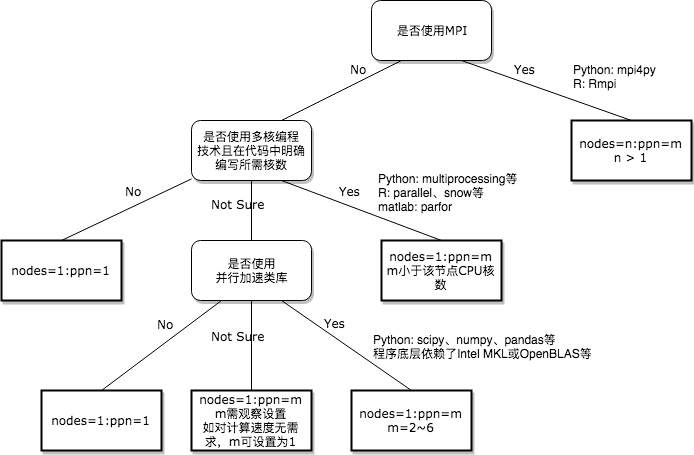

# 合理申请计算资源

高性能计算集群具有公共共享属性的，多个院系的老师和学生都会在我们的平台上进行计算和研究，而计算资源是有限的，为充分利用这些计算资源，同时满足自己的研究进展，需要用户合理地申请计算资源。个人申请过多资源，不仅导致别人排队等待，也会影响自己接下来申请计算资源；个人申请过少的资源，会导致自己的作业运行时间过长，长期占用某些资源，也不利于资源的长久持续利用。因此，我们希望用户申请适合自己的计算资源。

## 不要一次提交过多作业

集群禁止短时间内提交超过20个作业，尤其是运行时间超过三天且占用大量CPU资源的作业。

## 队列选择

目前我们拥有三个主要队列。其中 default 为默认计算队列，队列每台机器有24核心CPU和64GB内存，用以执行绝大多数普通计算任务；pnode 为胖节点队列，队列每台机器有40核心CPU和256GB内存，胖节点资源非常有限，如无特殊需求，请不要使用这个队列；debug 队列转为调试程序使用，对于新的程序，请使用debug队列来调试。

| 队列名  	| 计算资源                     	| 用途           	|
|---------	|------------------------------	|----------------	|
| default 	| 49台 * 24核处理器 / 64GB内存 	| 普通计算任务   	|
| pnode   	| 5台 * 40核处理器/ 256GB内存  	| 高负荷计算任务 	|
| debug   	| 2台 * 24核处理器 / 64GB内存  	| 调试程序专用   	|

## 申请CPU资源

每次提交作业时，都需要通过调度器来协调资源，具体使用上，需要编写一个 PBS 脚本，并在脚本中写明所需要的CPU资源。PBS脚本中需要有`#PBS -l nodes=1:ppn=12`这样的内容来申请CPU资源。[调度器介绍页面](job-scheduler.md)已经介绍了如何一些调度器的详细使用方法。

对于一些用户，可能不确定如何申请资源，这里根据下图的逻辑给出一些建议。




如果你对自己的程序是否使用了多核加速，那么可以使用下面的方法监控自己的程序，并调整自己的 `ppn` 的设置。

## 监控自己的程序

1. 先在登录节点qstat 得到你要查看的jobid，如下面所示的 6458 ：

```bash
Job ID                    Name             User            Time Use S Queue
------------------------- ---------------- --------------- -------- - -----
6458.rmdx-cluster         6-TZ-CCSDT-4.0-1 jh2017102784    188:34:4 R default
```

2. 然后qstat -f jobid(如6458)，在结果中找到 exec_host 那一行中，为你作业实际执行的节点。

```
exec_host = node-1-12/9+node-1-12/10+node-1-12/11+node-1-12/12
```

忽略`/`后面内容，程序实际执行的节点是 node-1-12 这台机器。

3. 使用`ssh node-1-12`命令登录到执行作业的节点，使用`top`命令，查看该机器上的作业运行情况。


上图中，每一行表示一个程序进程，USER列为提交作业的用户，%CPU列为作业本身所需要的CPU资源，100%表示该程序占用1个CPU核心，2400%表示占用24个核心。其他非用户列可不用关心。